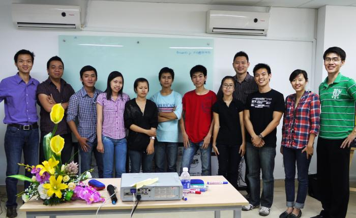

# DESIGN AND MAKER CAMPS

Two Open Design Camps offers designers, artists and developers a chance to share ideas, concepts and tools in Ho Chi Minh City and Cantho City.

## OPEN DESIGN CAMP SAIGON

Public presentations of design work, ideas and software used in todays Free Culture community and ideas for sharing.

Date: 6 April, 2012

Time: 9am - 5pm

Location: University of Fine Arts, Đại học Mỹ thuật Thành phố Hồ Chí Minh, 05 Phan Dang Luu, Dist. Binh Thanh, Ho Chi Minh City

Web: [www.hcmufa.edu.vn](https://www.hcmufa.edu.vn)

Admission: Free

[View Larger Map](https://www.google.com/maps?f=q&source=embed&hl=en&geocode&q=University+of+Fine+Arts,+05+Phan+Dang+Luu,+Dist.+Binh+Thanh,+Ho+Chi+Minh+City,+Vietnam&ie=UTF8&hq&hnear=Phan+%C4%90%C4%83ng+L%C6%B0u,+Ho+Chi+Minh+City,+Vietnam&ll=10.804558,106.687589&spn=0.012646,0.025792&z=15)

## MAKER CAMP CANTHO

Public presentations of design work, ideas and software produced during the Open Design Weeks 2012 Vietnam.

Date: 13 April 2012

Time: 9am - 5pm

Location: MBM Workspace, 93 Mau Than, Xuan Khanh Ward, Ninh Kieu Dist, Can Tho City

Admission Fee: Free

[View Larger Map](http://maps.google.com/maps?f=q&source=embed&hl=en&geocode=&q=Can+Tho,+Ninh+Ki%E1%BB%81u,+Can+Tho,+Vietnam&aq=&sll=10.802147,106.694924&sspn=0.006439,0.013078&ie=UTF8&hq=&hnear=Can+Tho,+Ninh+Ki%E1%BB%81u,+Can+Tho,+Vietnam&ll=10.029921,105.775831&spn=0.006339,0.012853&z=16&iwloc=A)
