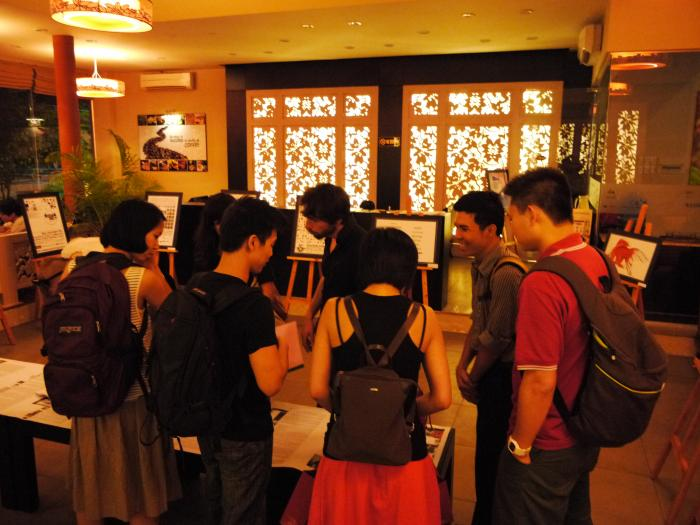

# OPEN DESIGN EXHIBITION

On Friday 7 April: Opening of the Open Design Exhibition featuring free artworks from designers across the globe.

Libre Graphics Artworks including Free Fonts, Posters, Comics and Books on display at district 1 in Saigon (Ho Chi Minh City)

Inkscape Art, Map art and Libre Art books at FOSSASIA Open Design Exhibition in Saigon

## OPEN DESIGN EXHIBITION

Date: Friday 7 April, 2012

Time: 8 pm

Location: Trung Nguyen Cafe, 19B Pham Ngoc Thach, Dist. 1, HCMC

Web: [www.trungnguyen.com.vn](www.trungnguyen.com.vn)

Admission Fee: Free

[View Larger Map](http://maps.google.com/maps?q=10.784125,106.694019&num=1&sll=10.781669,106.696912&sspn=0.010525,0.016189&ie=UTF8&source=embed&ll=10.784492,106.694069&spn=0.02951,0.051498&z=14)
