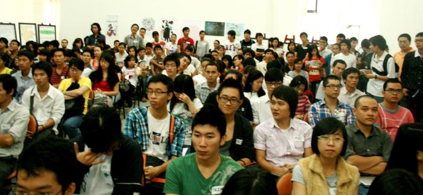
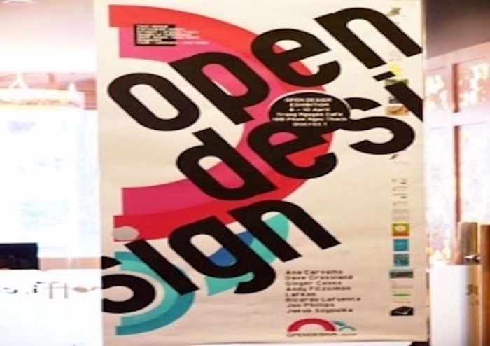
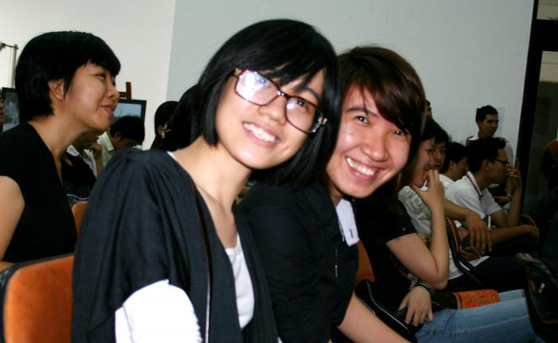
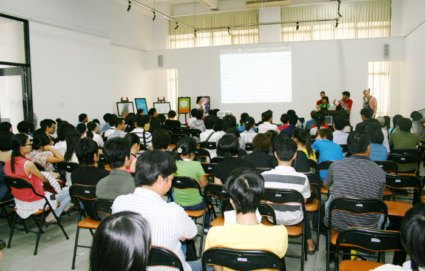
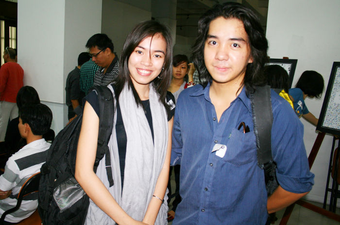

# FOSSASIA OPEN DESIGN WEEKS ASIA 2011/2012

The [FOSSASIA](http://fossasia.org/) Open Design Weeks Asia took place in Ho Chi Minh City and Cantho (Vietnam) in 2011 and 2012. A wrap up is on our [blog here](http://blog.fossasia.org/opendesignasia-weeks/).

The Open Source Design Weeks are all about sharing of graphic designs, [Libre Graphics](http://libregraphics.net/), [Open Source Graphics Software](https://libregraphicsmeeting.org), open content and Free Culture Practices, [FasionTec](http://fashiontec.org/) and the [maker community](http://meshcon.net/).

Events during the design weeks include workshops, design camps to share expertise in an unconference, company meet ups to establish international cooperations, presentations in Universities and training workshops.

Opening of Open Design Weeks by Hong Phuc Dang and Mario Behling

Many students and local Vietnamese artists participated in the Open Source Design Weeks.

Connecting Open Source Designers with local participants in Vietnam during Open Source Design Weeks.

The intensive workshops with International designers and typographers focus on collaborative font design, mapping and publication. The workshops were held at at the University of Arts and Design in Ho Chi Minh City and the [CanTho Mekong Hotel Xoai](http://hotelxoai.com).

Presentation of Fontforge at University of Arts Saigon.

Happy students at Open Design Weeks. More than 50% of all participants are female.

Open Design Weeks Asia drawing many participants, students, designers and developers.

A lively discussion about the opportunities of Open Source Design and Open Design workflows took place in the University of Arts in Ho Chi Minh City.

Artists and design students want to learn about digital tools at Open Design event in Saigon.

Enjoying dinner and social meetups during the FOSSASIA Open Design Weeks in Saigon (Ho Chi Minh City) with developers and designers from Singapore.

## About

OpenDesign.Asia is dedicated at promoting sharing among designers and cooperation across the continent and around the world. The initiative was started by a group of international contributors during [FOSSASIA](http://fossasia.org) 2010 in Ho Chi Minh City by [Hong Phuc Dang](https://twitter.com/hpdang) and [Mario Behling](http://mariobehling.de). 

**Open Design** is the development of graphical interfaces, physical products, machines and systems through use of publicly shared design information and Open Source applications. The goals and philosophy are identical to [Open Source Software](http://en.wikipedia.org/wiki/Open_source) and [Open Source Hardware](http://en.wikipedia.org/wiki/Open_source_hardware) design, but reside in a different paradigm.

The "open design" movement as of 2011 is fairly nascent and holds great potential for the future. In some respects design and engineering are even more suited to open collaborative development than the increasingly common open-source software projects, because with 3D models and photographs the concept can often be understood visually. It is not even necessary that the project members speak the same languages to usefully collaborate. 

Compared to software development where there are mature and widely used tools available and the duplication and distribution of code cost next to nothing there are barries to overcome in Open Design project, especially when it involves the production of physical objects. Creating, testing and modifying physical designs is not quite so straightforward because of the effort, time and cost required to create the physical artefact; although with access to emerging flexible computer-controlled manufacturing techniques the complexity and effort of construction become easier.

Please join us on [Facebook](https://facebook.com/OpenDesignAsia) and follow us on [twitter](https://twitter.com/opdasia).

Hong Phuc Dang, organizer of the Open Design weeks at a meetup in the Saigon Science Park in Ho Chi Minh City
