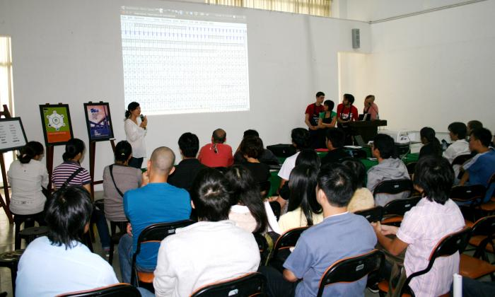

# Schedule

## Open Design Week 1

*April 2-9, 2012, Ho Chi Minh City (Saigon)*

The first week will give Vietnamese designers in Ho Chi Minh City the opportunity to get to know and learn from international designers from Europe. International visitors will meet up with companies and students in universities. Three introduction workshops will offer local designers the chance to dig into new design concepts and learn about new Open Source software tools used in todays European art and design scene. These workshops are a preparation for the second intensive work week. At the end of the week an exhibition dedicated to Open Design will be opened.

#### Audience

Designers, university lecturers, students, artists, local open source communities.

#### Goals

-introducing new design tools, software and practices at presentations across universities and companies in HCM

-gathering people who are interested in learning about design with Free and Open Source software tools

-offering Vietnamese to get to know European designers and learn about their design practices

<table class="tg" style="undefined;table-layout: fixed; width: 777px">
<colgroup>
<col style="width: 111.19999998807907px">
<col style="width: 98.19999998807907px">
<col style="width: 305.19999998807907px">
<col style="width: 148.19999998807907px">
<col style="width: 114.19999998807907px">
</colgroup>
  <tr>
    <th class="tg-jq4u">Dates</th>
    <th class="tg-jq4u">Time</th>
    <th class="tg-jq4u">Activity</th>
    <th class="tg-jq4u">Location</th>
    <th class="tg-jq4u">Admission</th>
  </tr>
  <tr>
    <td class="tg-zlxb">Friday</td>
    <td class="tg-zlxb">8am-22pm</td>
    <td class="tg-zlxb">International designers arrive in Vietnam</td>
    <td class="tg-zlxb">Ho Chi Minh City</td>
    <td class="tg-zlxb">N.A.</td>
  </tr>
  <tr>
    <td class="tg-zlxb">Saturday</td>
    <td class="tg-zlxb">8 pm</td>
    <td class="tg-zlxb">Open Design Pre-Event Meet up(Tell the waiters our key word "opendesign" to join us on the roof.)</td>
    <td class="tg-zlxb">Roof top @ Spotted Cow Bar, 111 Bui Vien, Dist. 1, HCMC</td>
    <td class="tg-zlxb">Welcome Drink sponsored by MBM</td>
  </tr>
  <tr>
    <td class="tg-zlxb">Sunday</td>
    <td class="tg-zlxb">9-12pm and 1.30-5pm        7pm</td>
    <td class="tg-zlxb">Open Design Camp Saigon Workshop 1: Fonts Workshop 2: Vector illustration Workshop 3: Lay-out     Open Design Weeks - Welcome Dinner(Call Hong Phuc for reservations: 0939871001) </td>
    <td class="tg-zlxb">University of Fine Arts, 05 Phan Dang Luu, Dist. Binh Thanh, HCMChcmufa.edu.vn  Thanh Nien Restaurant 11 Nguyen Van Chiem, Dist 1, HCMC</td>
    <td class="tg-zlxb">Free      Entrance Fee </td>
  </tr>
  <tr>
    <td class="tg-zlxb">Monday</td>
    <td class="tg-zlxb">8am-5pm</td>
    <td class="tg-zlxb">Visit of university in HCMC: Presentations and introduction of software tools for designers</td>
    <td class="tg-zlxb">University of Fine Arts, 05 Phan Dang Luu, Dist. Binh Thanh, HCMChcmufa.edu.vn</td>
    <td class="tg-zlxb">Free</td>
  </tr>
  <tr>
    <td class="tg-s6z2">Tuesday</td>
    <td class="tg-s6z2">8am-5pm</td>
    <td class="tg-s6z2">Workshop Sessions at TMA Solution in Quang Trung Software City</td>
    <td class="tg-s6z2">TMA Solutions, QTSC</td>
    <td class="tg-s6z2">Donations are welcome</td>
  </tr>
  <tr>
    <td class="tg-s6z2">Wednesday</td>
    <td class="tg-s6z2">8am-5pm</td>
    <td class="tg-s6z2">Workshop Sessions / Visit to Designer Labs and companies</td>
    <td class="tg-s6z2">FPT Arena,arena.edu.vn</td>
    <td class="tg-s6z2">Donations are welcome</td>
  </tr>
  <tr>
    <td class="tg-s6z2">Thursday</td>
    <td class="tg-s6z2">8am-5pm</td>
    <td class="tg-s6z2">Exhibition preparation</td>
    <td class="tg-s6z2">Lam Design Studio HCM</td>
    <td class="tg-s6z2">Free</td>
  </tr>
  <tr>
    <td class="tg-s6z2">Friday</td>
    <td class="tg-s6z2">10am-5pm            8pm </td>
    <td class="tg-s6z2">Set up of Open Design Exhibition with local partners          Opening of Open Design Exhibition</td>
    <td class="tg-s6z2">Trung Nguyen Cafe, 19B Pham Ngoc Thach, Dist. 1, HCMC     Trung Nguyen Cafe, 19B Pham Ngoc Thach, Dist. 1, HCMC</td>
    <td class="tg-s6z2">Free          Entrance Free</td>
  </tr>
  <tr>
    <td class="tg-s6z2">Saturday</td>
    <td class="tg-s6z2">10 am</td>
    <td class="tg-s6z2">Designers preparation for second week</td>
    <td class="tg-s6z2">NA</td>
    <td class="tg-s6z2">NA</td>
  </tr>
  <tr>
    <td class="tg-s6z2">Sunday</td>
    <td class="tg-s6z2">7am-7pm</td>
    <td class="tg-s6z2">Mekong Excursion and gathering material "Between Folk Art and Industrial Production". Arrival in Cantho in evening</td>
    <td class="tg-s6z2"></td>
    <td class="tg-s6z2"></td>
  </tr>
</table>

## Open Design Week 2

*Can Tho City, 11-16 April, 2012*

The second week is set up around two intensive design workshops in Cantho City addressing themes and methods linked to interdisciplinary work with new software tools including content publication, mapping and professional font design. Tools taught include Inkscape, Gimp, OpenStreetMap, Fontforge, GIT/SVN, FontMatrix, Fonzy/Nancy and ConTeXT. Each workshop runs for two days. Participants of the workshops will contribute as active collaborators and learn by hands on experience from the five European designers. The outcome of workshops will be presented during the Design Camp Cantho at the end of the week.

#### Audience

Students, amateurs and professionals with a design/art background or in computer science/software development. Participants are willing to engage in interdisciplinary experimentation and creative production. Each workshop has max. 20 participants. Scholarships are available.

#### Goals

-learning together with others about new design tools and ideas

-enabling participants to do design projects with free software tools

-creating an opportunity for indepth exchange between participants from two continents

-engaging in collaborative work across disciplinary, cultural and language borders

-documenting the process in a way that it can be used in future projects

<table class="tg" style="undefined;table-layout: fixed; width: 772px">
<colgroup>
<col style="width: 110.19999998807907px">
<col style="width: 98.19999998807907px">
<col style="width: 303.19999998807907px">
<col style="width: 147.19999998807907px">
<col style="width: 113.19999998807907px">
</colgroup>
  <tr>
    <th class="tg-jq4u">Dates</th>
    <th class="tg-jq4u">Time</th>
    <th class="tg-jq4u">Activity</th>
    <th class="tg-jq4u">Location</th>
    <th class="tg-jq4u">Admission</th>
  </tr>
  <tr>
    <td class="tg-zlxb">Monday</td>
    <td class="tg-zlxb">9.00   9.10am-12pm and 1.30-5pm   8pm</td>
    <td class="tg-zlxb">Official Opening Second Design Week Cantho  Workshop (Day 1): Font Design    Cantho Night/Evening Life Excursion photograph collections for material collection</td>
    <td class="tg-zlxb">3D Cafe, 11/39B Mau Than  3D Cafe, 11/39B Mau Than   Cantho</td>
    <td class="tg-zlxb">N.A.   N.A.   N.A.</td>
  </tr>
  <tr>
    <td class="tg-zlxb">Tuesday</td>
    <td class="tg-zlxb">9am-12pm and 1.30-5pm</td>
    <td class="tg-zlxb">Workshop (Day 2): Font Design</td>
    <td class="tg-zlxb">3D Cafe, 11/39B Mau Than</td>
    <td class="tg-zlxb">(see above)</td>
  </tr>
  <tr>
    <td class="tg-zlxb">Wednesday</td>
    <td class="tg-zlxb"> 6am-10am        11am-6pm</td>
    <td class="tg-zlxb">Mekong Floating Market Boat tour, visit to Crocodile Island followed by visit to the Cantho museum     OSP gathers and co-works with local designers, preparations for second workshop</td>
    <td class="tg-zlxb">Mekong River       Cantho, MBM</td>
    <td class="tg-zlxb">Boat fee       Free</td>
  </tr>
  <tr>
    <td class="tg-zlxb">Thursday</td>
    <td class="tg-zlxb">9am-12pm and 1.30-5pm</td>
    <td class="tg-zlxb">Workshop (Day 1): Collaborative Publication</td>
    <td class="tg-zlxb">3D Cafe, 11/39B Mau Than</td>
    <td class="tg-zlxb">Please enquire for details: Phuc Hau at 07103833636</td>
  </tr>
  <tr>
    <td class="tg-s6z2">Friday</td>
    <td class="tg-s6z2">9am-12pm and 1.30-5pm</td>
    <td class="tg-s6z2">Workshop (Day 2): Collaborative Publication</td>
    <td class="tg-s6z2">3D Cafe, 11/39B Mau Than</td>
    <td class="tg-s6z2">Please enquire for details: Phuc Hau at 07103833636</td>
  </tr>
  <tr>
    <td class="tg-s6z2">Saturday</td>
    <td class="tg-s6z2"> 9am-4pm     7pm</td>
    <td class="tg-s6z2">Design Camp Cantho: Public presentations of design work, ideas and software     Open Design Dinner “Good Bye Mekong Delta” </td>
    <td class="tg-s6z2">Cantho, MBM     Cantho Restaurant</td>
    <td class="tg-s6z2">Free     Cover Fee</td>
  </tr>
  <tr>
    <td class="tg-s6z2">Sunday</td>
    <td class="tg-s6z2">8am</td>
    <td class="tg-s6z2">OSP travels back to Europe</td>
    <td class="tg-s6z2">HCM (Saigon)</td>
    <td class="tg-s6z2"></td>
  </tr>
</table>
